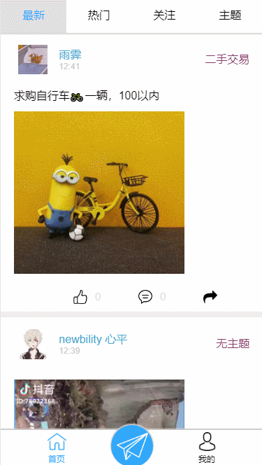
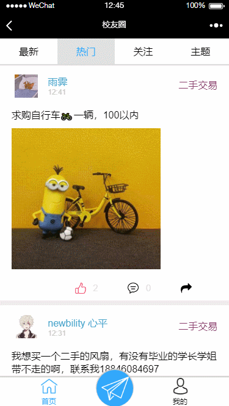

# 东北农业大学校友圈

> &#x1F393; [校友圈](https://neau-lib.xiaonei.io/feed/#/)

**试用项目首先要关注微信测试号** 


**项目预览地址：&#x1F449;** [https://neau-lib.xiaonei.io/feed/#/](https://neau-lib.xiaonei.io/feed/#/) 或 扫描二维码


&#x1F625;鉴于校园内同学之间信息沟通不方便，尤其在二手交易和失物招领等地方，同学没有一个交流的平台
&#x1F4A1;于是我借鉴像微博，即刻这样的信息流平台独立开发了属于东北农业大学信息交流平台-->校友圈
&#x1F4AA;基于Egg.js、七牛云、微信公众平台开发 、MongoDB编写了、数据后台及API接口，基于Vue.js、Vue Router以及Mint-UI对前端界面进行了设计编写

搭建出了如下所示的东农校友圈&#x1F308;：

> ##### 1.二手交易信息Gif预览


> ##### 2.分享的有趣视频Gif预览


> ##### 3.评论及个人信息Gif预览


> &#x26A0; Tips：还有很多其他的功能未能一一截成GIF动图


> &#x26A0; Tips：查看后端项目点这里[后端项目](https://github.com/BFjacky/feed.git)

## 安装 / 开始开发

```bash
  # 安装依赖
  $ cd webdev
  $ npm install

  # 启动开发模式
  $ npm run dev
```

> &#x26A0; Tips：应用将会运行在 [http://localhost:8080](http://localhost:8080)

## 使用cnpm或淘宝镜像安装

因部分资源下载缓慢，推荐使用淘宝镜像
```bash
npm --registry https://registry.npm.taobao.org install
```
或者使用cnpm安装
```bash
npm --registry https://registry.npm.taobao.org install cnpm -g
cnpm install
```

## 相关技术栈

  + Vue.js
  + Webpack
  + Vue Router
  + Mint-UI
  + axios
  + Babel

## 目录结构

```bash
  . libWebApp
  ├── assets                    # Readme中图片资源
  ├── build                     # Webpack 及 Vue Loader 相关配置项
  ├── config                    # 配置选项
  ├── dist                      # 编译后的文件
  ├── src                       # 源文件
  │   ├── assets                # 图像资源
  │   ├── components            # 组件
  │   ├── router                # 路由
  │   ├── App.vue               # 主页面
  │   ├── lodash.js             # 安装lodash工具库
  │   └── main.js               # 主脚本文件
  ├── static                    # 静态资源目录
  ├── test                      # 测试代码
  ├── .babelrc                  # Babel 配置项
  ├── .editorconfig             # 编辑器配置项
  ├── .gitignore                # Git 忽略文件列表
  ├── .postcssrc.js             # PostCSS 配置文件
  ├── index.html                # 主 HTML 文件
  ├── package-lock.json         # 包依赖锁定文件
  ├── package.json              # 包描述文件
  └── README.md                 # 本说明文档
```

## 整体设计思路简述

  + 我们将整个前端页面划分为六个模块&#x1F355;：
    - 首页
    - 图片、视频展示模块
    - 个人信息模块
    - 编辑内容模块
    - 答题模块
    - 评论信息模块
  + 采用组件化开发
  + 将公共方法和常量放置在helper文件夹下
  + 自己生成一个events hub，来监听不同地方发出的不同事件
  + 自己编写store.js来保存不同组件的状态

> &#x26A0; Tips：欢迎在我的 [GitHub Issue](https://github.com/BlueSky1997AL/neau-card/issues) 页沟通交流并提出您的宝贵建议，您的建议是我成长的动力来源 &#x1F603;

## 开发模式跨域解决方案

在开发过程中，由于采用了前后端分离开发的方法，使得后端（Egg.js - 7001端口）与前端（Vue.js - 8080端口）产生了跨域问题 &#x1F4A2;  
&#x1F4A1; 解决方案：使用egg.js中的插件Egg-cors;

> &#x26A0; Tips：在生产环境中，将已编译好的文件合并入后端系统中时不会出现跨域问题，因为前端请求路由与后端路由处于同一域名和端口下。此处的跨域问题仅出现在开发过程中(生产环境请注释掉这段代码)
 ```js
  //libBackend/config/config.default.js
  config.cors = {
    allowMethods: 'POST,GET',
    credentials: true,
  }
 ```

## 生产环境

&#x1F4E6; 在生产环境中发布，需要先对项目进行编译

```bash
  # 生产环境编译
  $ npm run build

```

编译成功后，将 `dist` 目录中编译好的文件转移至后端静态资源文件夹中即可  
看起来，我们做的很棒  
但是由于服务器带宽的限制 &#x26D4; ，以及并发时过多网络请求对服务器性能的消耗，这样的部署方式效果并不理想。因为我们将一些不必要的工作交给了服务器，消耗了服务器的资源，说白了，这样做有点大材小用，造成页面访问响应慢，服务器负载大  
因此，我们需要将静态资源文件的托管交给CDN，也就是下一部分我们需要讨论的内容 &#x1F447;

## CDN 加速

&#x1F680; 因为学生9.9优惠服务器的带宽只有1M,使得静态资源放置在服务器上会导致静态资源请求极慢，并发量稍大便会出现几分钟的白屏，所以将静态资源打包放置在了又拍云存储上，加快了加载静态资源的速度，同时也不会占用服务器带宽

网站响应速度快了，服务器负载也小了！&#x1F389;

## 图片、视频资源云存储

显然，将大型图片资源存在服务器是不合理的...所以使用七牛云存储来完成上传下载图片视频资源的功能

## 微信公众平台授权

因为程序的使用场景在微信浏览器中打开，所以使用了微信公众平台的授权获得用户信息，目前绑定在一个测试号上面。

## ToDos

  + 未来会将其使用Weex重构
  + 将状态管理移交给Vuex，不再手动管理


> &#x26A0; Tips：查看后端项目点这里[后端项目](https://github.com/BFjacky/feed.git)
